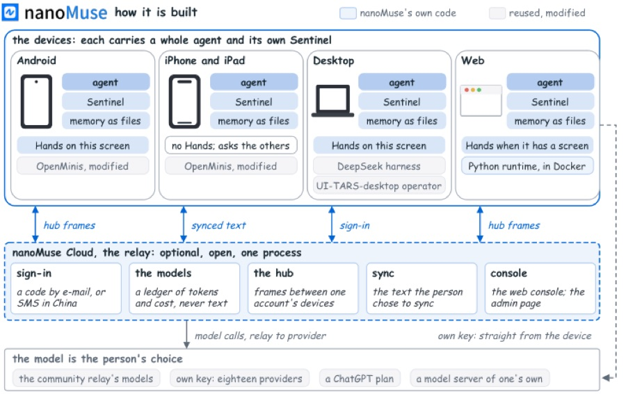
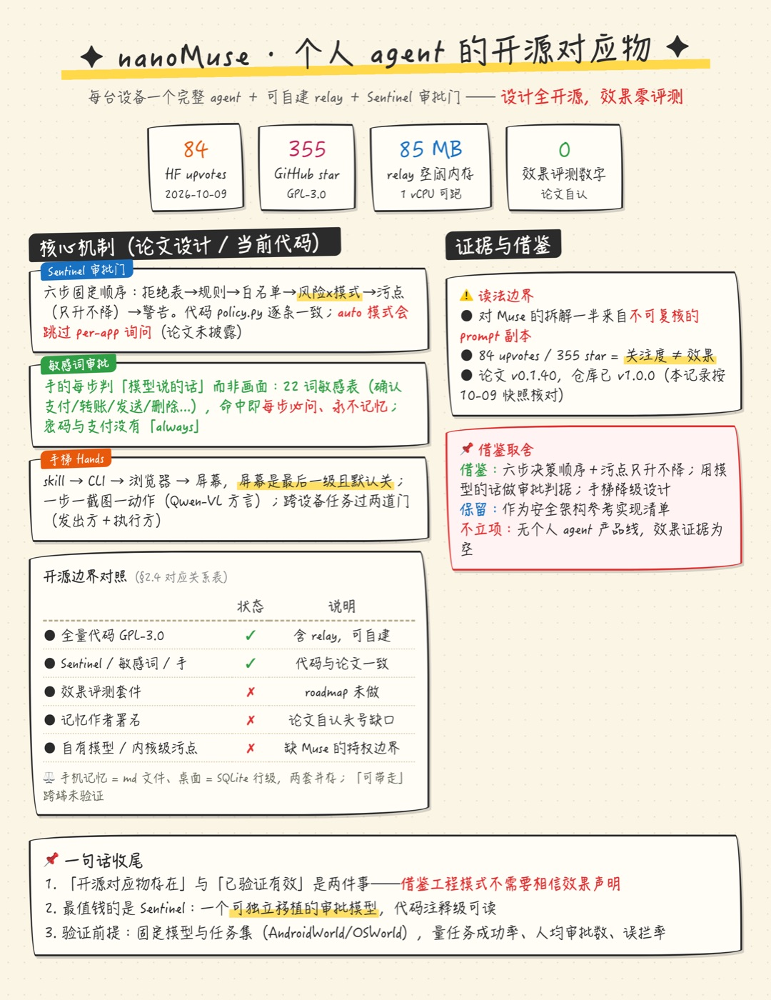

# paper-reading-skill

论文阅读记录全家桶：把一篇（或一批）论文变成「结论前置、证据可复核」的深度阅读记录，附论文原图提取嵌入、手绘风总体一览图、飞书云文档发布。在 25 篇语音论文批次上全流程实战验证。

## 一句话上手

安装后对你的 AI 编码助手（Claude Code / Cursor 等）说：

```
用 paper-reading-record 技能，读这篇论文并生成阅读记录：https://arxiv.org/abs/2610.09934
```

或者批量：

```
用 paper-reading-record 技能批量读这个飞书 wiki 里的 25 篇论文，逐篇生成阅读记录并发飞书
```

或者本地材料：

```
用 paper-reading-record 技能读 /path/to/paper.pdf，只存本地
```

## 打包内容

```
skills/
  paper-reading-record/   主技能: 四段式阅读记录 + 批量管线 + 6 个自检脚本
  hand-drawn-poster/      渲染技能: HTML/CSS -> 无头 Chrome 截图, 产出手绘风总体一览 PNG
  feishu-lark-docs/       飞书技能: lark-cli 封装, 读 wiki/云文档、建云文档
install.sh                一键安装（复制 skills 到 ~/.claude/skills 或 ~/.cursor/skills）
examples/plan.md          批量清单示例（arXiv / hf: / pdf: / md: 四种 source 混排）
examples/nanoMuse/        完整成品演示（HuggingFace 输入源单篇全流程产物）
```

## 产出什么

每篇论文得到一个目录：

```
YYYY-MM-DD-records/
  pNN-<短名>-论文阅读记录.md     四段式记录（结论摘要/论文解读/项目解读/附录）
  pNN-figures/                   从 arXiv HTML 提取的论文原图（魔数校验后）
  pNN-overview/                  手绘总览 HTML + PNG
```

记录骨架（顺序固定，结论前置）：

1. **结论摘要** — 30 秒拿到判断：核心判断 3 条、mermaid 流程图、论文设计/当前代码逐条对照、取舍
2. **论文解读** — 背景与目标 / 技术方案（图随机制小节走）/ 实验评估 / 局限与借鉴价值
3. **项目解读** — 按基准 commit 的源码分析（无代码仓库时按公开材料复现路径写）
4. **附录** — 公式与符号 / 完整实验数据表（照抄原论文）/ 参考资料
5. **总体一览（手绘）** — 一页 PNG 视觉摘要，每个数字可回溯正文

可选：批量转飞书云文档（图片自动上传、链接汇总成一页总目录）。

## 输入与输出选项

| 输入源 | 写法 |
|---|---|
| arXiv 论文 | 链接或 id（默认） |
| HuggingFace 论文页 | `hf:2610.08699` 或完整 `https://huggingface.co/papers/...` 链接（自动取 upvotes/GitHub 仓库等元信息，全文仍从 arXiv 抓） |
| 本地 PDF | `p01=/path/x.pdf`（pypdf 抽全文） |
| 本地 markdown | `p01=/path/x.md`（剥离标记成全文） |
| 飞书 wiki 清单 | lark-cli 读出节点后转批量清单 |

输出去向：仅本地 markdown（默认，零飞书权限）/ 本地 + 飞书云文档 / 再加汇总总目录。详见主技能 SKILL.md「输入源与输出去向」。

## 批量管线（10 篇以上）

```
阶段 0 清单 -> 阶段 1 抓取(fetch_arxiv.py) -> 阶段 2 下载原图(download_figures.py)
-> 阶段 3 撰写(并行子代理) -> 阶段 4 手绘总览 -> 阶段 5 飞书(to_feishu + create_feishu_docs)
-> 阶段 6 汇总(build_summary.py) -> 阶段 7 终检(batch_check.py 全绿)
```

每阶段产物落盘即状态，断点续跑；每阶段有自检清单与降级路径（SVG 404 重试、arXiv 服务端缺图时从 PDF 提取、占位文件魔数拦截）。

## 环境要求

- macOS（无头 Chrome 截图用系统 Chrome；Linux 需 chromium）
- python3（标准库即可；本地 PDF 输入需 `pip3 install pypdf`）
- 发飞书需 lark-cli（`npm install -g @larksuiteoapi/lark-cli`，再 `lark-cli config init` + `lark-cli auth login`）
- 全部脚本只依赖 curl / Chrome / python3，无其他安装项

## 安装

```bash
git clone https://github.com/shu-admin/paper_reading_skill.git
cd paper_reading_skill
bash install.sh            # 交互选择装到 ~/.claude/skills 还是 ~/.cursor/skills
```

详细说明见 [INSTALL.md](INSTALL.md)。

## 使用示例

单篇（Wan 2.5 VAE 论文）：

```bash
python3 skills/paper-reading-record/scripts/fetch_arxiv.py \
  --ids 2503.20314 --outdir /tmp/one
# 之后由 AI 助手按 SKILL.md 流程撰写、提图、渲染总览
```

HuggingFace 论文页（自动附带 upvotes / GitHub 仓库 / 摘要等元信息）：

```bash
python3 skills/paper-reading-record/scripts/fetch_arxiv.py \
  --ids hf:2610.08699 --outdir /tmp/hf
# meta.json 里会多出 hf 块: upvotes / githubRepo / githubStars / projectPage / summary
```

批量清单（examples/plan.md）：

```markdown
# 批次清单
## p01 Itgan: NADI 2026 阿拉伯语 ASR
- source: https://arxiv.org/abs/2610.09934
- note: 共享配方 + 按任务诊断

## p02 内部材料
- source: pdf:/Users/you/papers/x.pdf
```

```bash
python3 skills/paper-reading-record/scripts/fetch_arxiv.py \
  --from-md --ids examples/plan.md --outdir /tmp/batch
```

## 完整成品演示：nanoMuse（HuggingFace 论文）

[examples/nanoMuse/](examples/nanoMuse/) 是一篇用 HuggingFace 输入源跑出来的完整成品，全部产物都在仓库里可直接翻看：

- 论文：[nanoMuse: An Open-Source Personal Agent for Every Device You Own](https://huggingface.co/papers/2610.08699)（HF Daily Papers，upvotes 84 @ 2026-10-09，附 GPL-3.0 开源仓库）
- 成品：[p01-nanoMuse-论文阅读记录.md](examples/nanoMuse/p01-nanoMuse-论文阅读记录.md) —— 四段式 352 行，浅克隆官方仓库核对到 commit `28edfc2`，6 张论文原图逐张读图验收后嵌入
- 原图：[p01-nanoMuse-figures/](examples/nanoMuse/p01-nanoMuse-figures/) —— 从 arXiv HTML 提取（含 1 张 SVG 转 PNG），魔数校验 6/6 通过

记录里「论文设计 / 当前代码」对照的实拍效果（论文架构图 + 代码核对结论并存）：

<p align="center">
  <a href="examples/nanoMuse/p01-nanoMuse-figures/S5_F5.png">
    
  </a>
</p>
<p align="center"><sub>论文原图 Figure 5：每台设备一个完整 agent，relay 只做会合点 —— 记录中逐条核对了它与 <code>nanomuse/sentinel/policy.py</code> 等实现的一致性</sub></p>

每篇记录收尾时由 `hand-drawn-poster` 技能渲染的一页手绘总览（数字全部回溯正文）：

<p align="center">
  <a href="examples/nanoMuse/p01-nanoMuse-总体一览.png">
    
  </a>
</p>
<p align="center"><sub>手绘总体一览：结论摘要 + 数字气泡 + 机制卡片 + 开源边界对照 + 借鉴取舍，一页看完</sub></p>

这条链路复现只需两条命令：

```bash
# 1. 抓取（HF 元信息 + arXiv 全文 + 图片扫描）
python3 skills/paper-reading-record/scripts/fetch_arxiv.py \
  --ids hf:2610.08699 --outdir /tmp/nanomuse

# 2. 下载论文原图（魔数校验 + SVG 转 PNG）
python3 skills/paper-reading-record/scripts/download_figures.py \
  --scan /tmp/nanomuse/scan.json --outdir <记录目录> --key p01=p01-nanoMuse

# 之后的撰写、读图验收、手绘总览由 AI 助手按 SKILL.md 流程完成
```

输入清单也支持 HF（examples/plan.md 混排示例）：

```markdown
## p02 HF 热门论文
- source: hf:2610.08699
```
