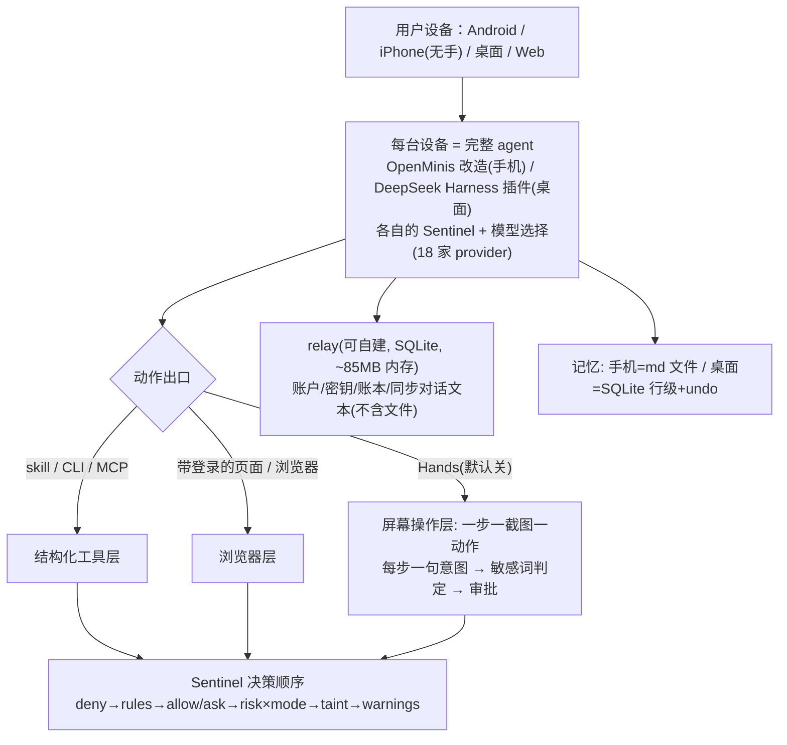
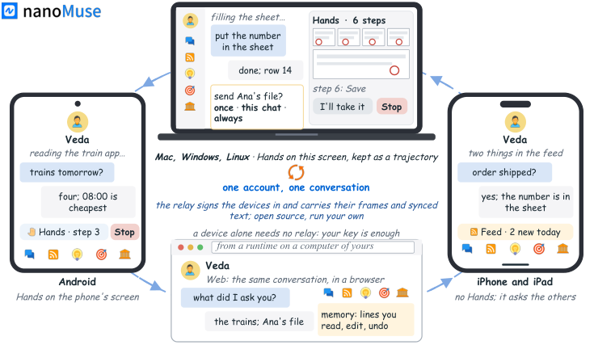
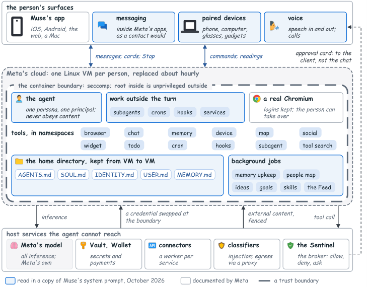
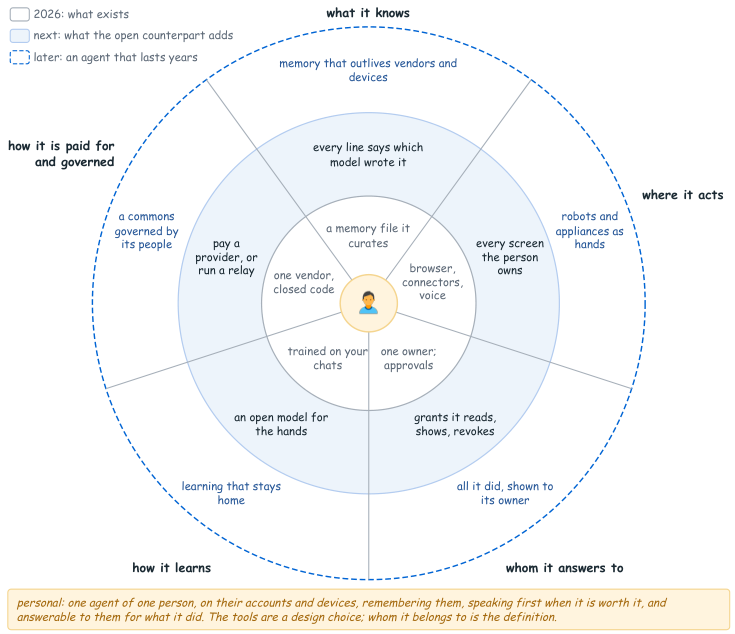
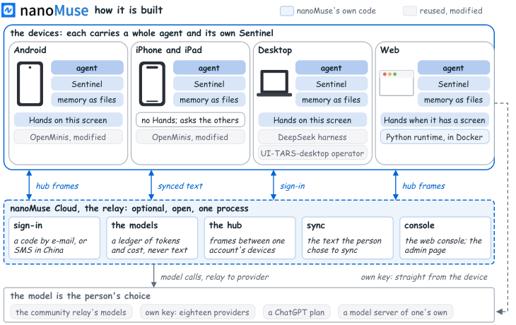
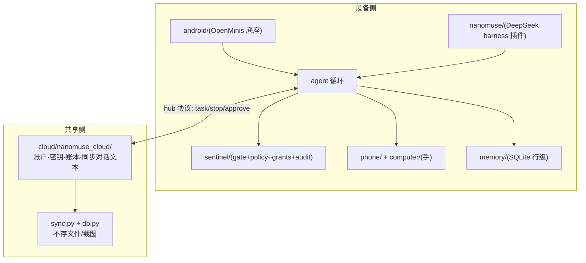
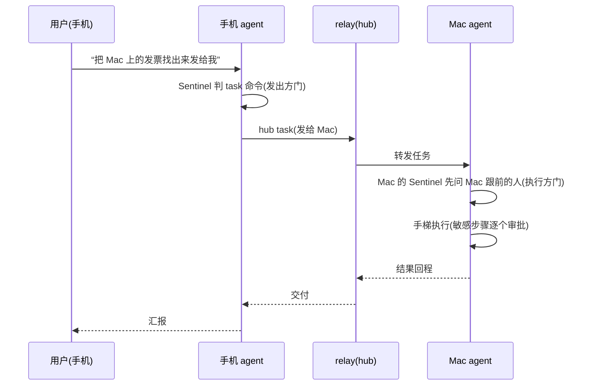
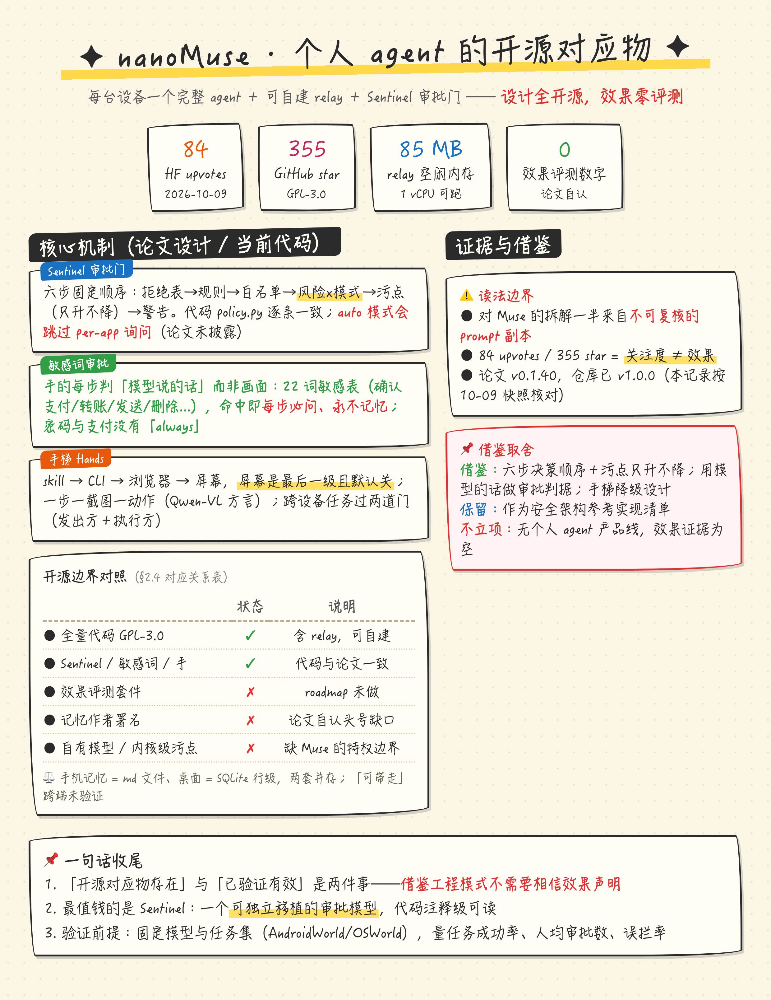

# p01-nanoMuse-论文阅读记录

> - 论文地址：https://arxiv.org/abs/2610.08699 （v1，2026-10-06 投稿，cs.AI，CC BY 4.0）
> - HuggingFace 页面：https://huggingface.co/papers/2610.08699 （Daily Papers，upvotes 84 @ 2026-10-09）
> - 项目仓库：https://github.com/nano-muse/nanoMuse （GPL-3.0-or-later，star 355 @ 2026-10-09）
> - 基准 commit：`28edfc29002c0fa8f039a195275563267e19e46f`（main 分支，2026-10-09 03:45 +0800；注意论文分析对象是 v0.1.40，本仓库当时已发布 v1.0.0）
> - 核查日期：2026-10-09

# 结论摘要

> 💡 这篇报告做的是「把 Meta Muse（2026-09 上市的闭源个人 agent）的开源对应物完整做出来」：每个设备跑完整 agent（手机/桌面/网页）+ 一个可自建的 relay 会合点 + Sentinel 审批门 + 可读的文件式记忆。**我们没有个人 agent 产品线，判断针对方法论与工程模式的可移植性。**主要借鉴点是 Sentinel 的「决策顺序 + 污点升级 + 敏感词禁直达」三层审批模型和「手」的最低一级 per-screenshot 循环设计；**HF upvotes/星数是关注度证据而非效果证据，本文无任何效果评测数字。**

## 核心判断

nanoMuse 是一篇「系统报告型」论文：定义个人 agent（五问三域）→ 用公开材料 + 一份生产 prompt 副本拆解 Muse → 给出 GPL-3.0 的开源实现。核心主张是「个人 agent 是一类软件而非模型，闭源形态在结构上不适合它，开源对应物必须完整存在」。

- **Sentinel 是论文最有复用价值的设计，且代码与论文描述高度一致。**论文说「固定决策顺序：拒绝表 → 个人规则 → always-allow/always-ask → 风险×模式 → 污点（只升不降）→ 警告（任何模式都拦）」；`nanomuse/sentinel/policy.py` 的 `evaluate()` 六步顺序逐条对应（deny_tools → rules → always_allow/ask → risk×mode → taint escalate → warnings），连「警告只有显式规则能豁免」都写进了注释。**但它是进程内策略边界，不是 Muse 的特权边界——同一信任域内被说服的模型仍可能绕过，论文 §7 自己承认这一点。**
- **「手」的治理思路（用模型的话而非画面做审批依据）是低成本可借鉴的。**每步让模型说一句「我要做什么」，确定性策略审这句话里的敏感词（默认表 22 个：确认支付/转账/发送/删除/pay now/transfer…），命中即每步必问、永不记忆。代码里 `gui.sensitive_words` 可配置且刻意保持窄（注释明说「支付」单字会误中支付宝 App 名）。**但手的成功率「数字不存在」，论文原话是「宁可说没有，也不估一个」——没有任何 benchmark 支持。**
- **记忆系统的「文件可读」主张在 Android 侧成立、桌面侧是另一套实现。**手机侧 SOUL.md/USER.md/GLOBAL.md/HEARTBEAT.md 落在 `/var/minis/memory/`（`SystemFiles.kt` 逐一对应）；桌面侧是 SQLite 行级记忆（`nanomuse/memory/store.py`），带变更日志与撤销。**论文没有把这两套的差异讲清，且「记忆无作者署名（哪个模型写的、置信度多少）」是论文自己列的头号缺口。**

**「开源对应物存在」与「对应物已验证有效」是两件事。**论文交付了前者（GPL-3.0 全量代码、72 个 Python 测试文件、810 个 Kotlin 文件）；后者论文一个评测数字都没给（无成功率、无人工接管率、无延迟分布）。借鉴其工程模式不需要相信其效果声明。

**取舍：**保留这篇作为「个人 agent 安全架构的参考实现清单」；值得借鉴的是 Sentinel 决策顺序、敏感词审批、手梯（skill → CLI → 浏览器 → 屏幕）的降级设计；不足以据此立项的是「个人 agent」产品本身——我们无此类产品线，且该项目的效果证据为空，社区热度（84 upvotes / 355 star）只说明选题受关注。

## 核心实现说明

**系统顶层二分：每台设备是一个完整 agent（自己的循环、自己的 Sentinel、自己的模型选择），relay 只做会合点（账户、密钥、在场、同步的对话文本），不是计算节点。**这与 Muse 的「云端一台 VM、设备都是窗口」形成结构对照。



**图注：nanoMuse v1.0.0 结构（依据本仓库 commit 28edfc2）。**箭头表示动作出口的分层选择而非并行执行；Hands 是最后一级且默认关闭。

以下用一个例子说明机制：用户对手机说「把我上周拍的照片整理成相册，发给妈妈」。系统应先试 skill/CLI（相册 App 有没有导出命令），不行试页面/浏览器，最后才开 Hands 逐屏操作；跨设备时若照片在 Mac 上，手机 agent 把任务交给 Mac agent，Mac 自己的 Sentinel 先问 Mac 跟前的人。例子用于说明机制，不代表已验证的模型输出。

### 1. Sentinel 审批门（论文 §5 vs `nanomuse/sentinel/policy.py`）

**论文设计：**agent 从不直接执行工具，每次调用过一道有固定决策顺序的门：拒绝表 → 人的规则 → always-allow/always-ask → 风险×模式 → 污点（读过隐私数据后，向白名单外发送数据的调用变问）→ 少数警告（破坏性 shell、管道下载、标签里的提交词）任何模式都放不过。审批是带范围的授权而非「是」：once / 本对话 / 常驻（按收件人、站点、文件夹）。带警告的调用只有 once，密码与支付永不记忆。

**当前代码：**`policy.py::evaluate()` 六步逐一实现且顺序一致；`gate.py::grant_options()` 确认「带警告 → 只给 once」「未知目的地且中危以上 → 不给常驻」。污点是 per-conversation 集合（`_tainted: set[str]`），删除对话即清除。**一个论文未提的细节：`mode="auto"` 会跳过 per-app 首次授权询问（`allow_app()` 直接 True），意味着「无人值守跑后台」模式下审批面收窄到警告与污点两条——不能认为 auto 模式与 ask 模式防护等价。**

### 2. 手（Hands）：最低一级的屏幕操作（论文 §5 vs `nanomuse/phone/operator.py`）

**论文设计：**到达一个 App 的梯子：skill → 命令行工具/MCP → 带人登录的页面 → 浏览器 → 最后才是设备屏幕本身。手是 per-screenshot 循环：模型看一张截图 + 目标 + 每步一句历史 + 可及性元素，答「一句思考 + 一句用人语言的意图 + 一个手势」。这句意图是治理抓手：确定性策略判不了画面，但能判模型「说要按什么」；标签含提交词（确认支付/转账/下单）的步骤每步必批。

**当前代码：**`operator.py` 用 Qwen-VL 的 `mobile_use` 方言（999×999 坐标空间，每步一个 `<tool_call>`），prompt 明文禁止输入密码/PIN/卡号/验证码、禁止自己确认支付转账下单，遇到这类步骤用 `hand_over` 交还给人。敏感词表在 `config.py`（默认 22 词：中文 14 + 英文 8），可配置。**桌面侧不是每步弹窗而是「轨迹留档 + 可介入」：整段运行留在聊天里（每步截图画上动作），人可以喊停接管——这与论文「轨迹可回看，活动画面不可」的原话一致。**

### 3. 记忆：文件与行级两套（论文 §5 vs `SystemFiles.kt` / `memory/store.py`）

**论文设计：**手机上记忆是 Markdown 文件（SOUL.md 是谁、USER.md 是谁的人、GLOBAL.md 跨对话常识、日记、HEARTBEAT.md 例程），人和 agent 的 shell 都能开。桌面 store 每条记忆一行、带变更日志和撤销，靠罕见词或 embedding 召回；tidy-up 只提议合并/丢弃、永不丢人写的那行。房间（Feed/Ideas/Goals）由 agent 在隐藏对话里写、人读。

**当前代码：**`SystemFiles.kt` 枚举五个文件（比论文多一个 feed-prepreferences.md），手机落在应用私有目录 `minis-global/memory/`——**「人能开」指的是 App 内编辑器，不是任意文件管理器直接可见**；HEARTBEAT.md 是只读渲染（从例程库生成，没有自己的文件）。桌面 `store.py` 是 SQLite：`memory_log` 表记变更与被替换文本（可撤销），`memory_vectors` 按 embedding 模型存向量。**论文自陈缺口在代码中得到确认：行级记忆没有模型署名、置信度、复查规则字段——「弱模型猜的一行被强模型当事实读」这个风险没有任何机制缓解。**

# 论文解读

## 1. 研究背景与目标

**用一份系统报告定义「个人 agent」并给出开源参照实现。**「个人 agent」在此定义为：替一个人在其账户、设备、文件上行事的程序，持续数周、部分在人不在时工作、事后以日志/账本/权限清单对人负责。它不是模型，是一类软件。

图、表引自[原论文](https://arxiv.org/html/2610.08699v1)（CC BY 4.0），中文说明为本报告分析。完整数据与参考资料见文末附录。

**研究目标：**论证个人 agent 的开源对应物必须完整存在（可运行、可读、可自建），并给出 nanoMuse 这个实例。

**应用约束：**闭源厂商 2026-09 五周内密集发布同类（Muse 9-8、Today 9-15、OpenMuse 9-15、Manus Cue 9-28、OpenAI dots 9-29），全部是「厂商云里每人一台计算机 + 端上薄客户端」形态；云计算机够不到无 API 的应用，而人每天用的银行/政务类应用多无 API。

**现有问题：**已有开源项目要么无屏幕（Hermes Agent、OpenClaw），要么单设备（OpenMinis），要么是服务器加窗口（OpenMuse）。作者的切入点：把 OpenMinis 的端上 agent 作底、DeepSeek harness 作桌面、补上 relay 与审批，拼出「每台设备都是完整 agent」的形态。

**分析**：论文贡献集中在「架构选择 + 安全机制的放置」这一层，全部效果声明（记忆管理、主动消息、手的可靠性）均无量化评测——这是它自己承认的（§7：成功率的数字不存在）。



**图 1　每台设备一个 agent、一个共享对话**（[原论文](https://arxiv.org/html/2610.08699v1#S0.F1)）

图注：引自原论文（CC BY 4.0）。展示部署形态：Android 与桌面承载完整 agent 并有各自屏幕的「手」；iPhone 因 iOS 不允许 App 操纵其他 App 而无手；Web 由人自己的计算机上的运行时服务。**屏幕画面是论文自绘示意图（"the screens are drawings, not screenshots"），不是产品截图，不能据此推断 UI 成熟度。**

## 2. 技术方案

### 2.1 对 Muse 的拆解方法（§3）

**用「出处分级」读闭源系统：每句话标注 documented（Meta 公开说的）/ prompt（生产 prompt 副本里读到的）/ observed（发布客户端上看到的）/ inferred（作者推断）。**Muse 的安全核心按此拆出：每用户一台 Linux VM；agent 与工具跑在带 seccomp 的容器里；Sentinel 是唯一许可权威；代理令牌在边界换成真凭证；内核级污点追踪（进程读用户数据后变污，只有窄策略内的干净请求免问）；浏览器子 agent 只看可及性树而非 DOM。**「prompt 副本」的出处本身不可验证（论文 §7 自认），标注为 prompt/inferred 的结论应折价读。**



**图 3　Muse 系统三区**（[原论文](https://arxiv.org/html/2610.08699v1#S3.F3)）

图注：引自原论文（CC BY 4.0）。蓝底为从 prompt 副本读到的部分，白底为 Meta 公开文档部分。展示 Muse 的边界设计（人的界面 / Meta 云的容器边界 / agent 够不到的宿主服务）。**不能证明 Muse 内部真实实现——这是作者对四份公开文档 + 一份来路存疑的 prompt 副本的重建。**

### 2.2 五问三域（§4）

**个人 agent 应满足的五个问题，每个按「2026 现状 / 开源对应物应补 / 长期形态」三档回答。**五问：记忆（人可读可改可带走，带署名与复查规则）；作用面（一个 agent、多双手，一切带屏/麦/电机的设备都是手与门）；问责（授权即与 agent 谈信任的小语言，支付与密码永不记忆）；学习（打断门槛可视可调，手用的模型以自愿贡献的轨迹训练）；付费与治理（小到能在家跑，最终是公共品）。论文自己承认 §5 对五问「大多不达标」。



**图 4　个人 agent 应是什么：五问为扇区、三域为环**（[原论文](https://arxiv.org/html/2610.08699v1#S4.F4)）

图注：引自原论文（CC BY 4.0）。这是作者的观点图（§4 自称 opinion），不是测量结果；内环放语音是刻意的（2011 年助手就会说话）。**此图表达设计立场，不能当作「已实现能力」的证据。**

### 2.3 nanoMuse 的当前形态（§5）

**「最小但完整」：每个部件存在且端到端工作，多数部件用最简实现。**与 Muse 的差异：加 Android 屏幕的手；设备本机操作而非 VM；全部开源含 relay；模型人选（18 家 provider 目录 + ChatGPT 计划 + 本机模型）。缺：自有模型、per-person VM 的内核污点与代理凭证、钱包、大团队的打磨。



**图 5　nanoMuse 的构造（v0.1.40）**（[原论文](https://arxiv.org/html/2610.08699v1#S5.F5)）

图注：引自原论文（CC BY 4.0）。每台设备是完整 agent、有自己的 Sentinel；relay 是唯一共享件，可选且开源；设备可拿自己的 key 直连 provider、绕过 relay。**注意版本差：论文画的是 v0.1.40（2026-10），本仓库已到 v1.0.0（2026-10-09），结构未变但细节有增量（见项目解读章 CHANGELOG 摘录）。**

### 2.4 论文设计与代码实现的对应关系

| 论文概念 | 代码位置 | 一致性 |
|-|-|-|
| Sentinel 固定决策顺序（六步） | `nanomuse/sentinel/policy.py` `evaluate()` | 一致（顺序逐条对应） |
| 审批是带范围授权、警告只有 once | `nanomuse/sentinel/gate.py` `grant_options()` | 一致 |
| per-screenshot 一步一动作循环 | `nanomuse/phone/operator.py`（Qwen-VL mobile_use 方言） | 一致 |
| 敏感词表（支付/转账/发送/删除） | `nanomuse/config.py` `gui.sensitive_words`（默认 22 词：中文 14 + 英文 8） | 一致，且刻意窄（防「支付」误中支付宝） |
| 手机记忆 = md 文件 | `SystemFiles.kt`（SOUL/USER/GLOBAL/HEARTBEAT + feed-preferences） | 基本一致（多一个文件；HEARTBEAT 是只读渲染非实体文件） |
| 桌面记忆行级 + 变更日志 + 撤销 | `nanomuse/memory/store.py`（SQLite `memory_log` 表） | 一致 |
| relay 只存账户/账本/同步对话文本 | `cloud/nanomuse_cloud/db.py`（`sync_conversations`/`sync_messages` 表，注释明言不存文件与图） | 一致 |
| 18 家 provider 目录 | `cloud/nanomuse_cloud/providers.json`（恰 18 条）+ `nanomuse/llm/catalogue.py`（内置 14 云 + 3 本地 + custom） | 一致（18 = 14 云 + Ollama/LM Studio/vLLM + custom 端点） |
| Hands 默认关闭 | `nanomuse/config.py` `HandsSettings`（docstring 明言 off by default） | 一致 |
| 「记忆带作者署名」 | 无对应字段（`store.py` 只有内容/时间/类目） | **未接入**——论文 §7 自认的头号缺口 |
| 训练数据贡献开关默认开（社区 relay） | `cloud/nanomuse_cloud/config.py` `IMPROVE_DEFAULT`（默认 0，环境变量可开） | 部分一致：**当前代码默认关，论文说社区 relay 上新账户默认开**——差异来自运营配置而非代码默认 |

## 3. 实验评估

### 3.1 评测设置

**本文无对照实验、无 benchmark、无消融。**全文唯一的表格（表 2）是「体积与成本估算」，来源标注为 release 文件、一次安装测量、provider 价格表——论文自己写明 "nothing here measures anyone's use"。 roadmap（§6）把「从失败轨迹构建评测套件」列为未做的近期工作，拟对照 AndroidWorld（手机）、OSWorld（桌面）、MemGUI-Bench（跨 App 记忆）、OS-Harm（应拒绝什么）。

### 3.2 体积与成本（原论文表 2，全部为估算/单机测量）

| 项 | 数值 | 来源 |
|-|-|-|
| Android App | 38 MB（arm64 下载） | release 文件 |
| 桌面 App | 256-498 MB 下载、928 MB 装后（Linux）、约 0.5 GB 空闲内存 | release 文件 + 本机测量 |
| relay | 单 Python 进程 + SQLite，约 85 MB 空闲内存；1 vCPU / 1 GB 可跑 | 本机测量 + 自建文档 |
| 自建 relay 服务器 | 约 ¥30-60/月（境内）或 $4-6/月（境外） | 自建文档估算 |
| 模型调用 | 百炼 2026-10 价目：chat ¥2 入 ¥8 出 / 百万 token，hands ¥3/¥12 | provider 价目估算 |

### 3.3 定性设计案例分析

论文用大量「产品行为」描述代替评测（胶囊浮层显示当前步骤与红色 Stop、下一步点击位置的环、桌面边缘呼吸光）。**这些是作者期望的产品行为与已实现的 UI，不构成可靠性证据：无成功率、无人均接管次数、无延迟分布，论文原话「数字不存在，我们宁可这么说也不估一个」。**这份诚实反而让「该借鉴什么」的判断更清晰：借鉴机制设计，不借鉴（不存在的）效果结论。

## 4. 研究局限与借鉴价值

### 4.1 指标口径与比较条件

1. **全文无数值效果声明，唯一的表格是体积/成本估算。**不能从中重建任何「效果」结论；HF upvotes 84 与 GitHub star 355（2026-10-09 核查）是社区关注度证据，与效果无关。
2. **对 Muse 的拆解依赖一份不可验证出处的 prompt 副本。**论文 §7 自认："prompts change with every deployment"；标注 prompt/inferred 的论断应折价。
3. **版本漂移：论文描述 v0.1.40，仓库已是 v1.0.0。**本记录的代码核对基于 2026-10-09 的 main（commit 28edfc2），与论文快照存在约一个月的增量（见项目解读章）。

### 4.2 公开材料与复现条件

| 材料 | 2026-10-09 核查结果 | 影响 |
|-|-|-|
| 核心项目 | GitHub 全量开源（GPL-3.0-or-later），本地浅克隆成功，1231 个 py/ts/kt 文件 | 可完整分析、可自建 |
| 安装产物 | README 提供各平台 release 链接（APK/TestFlight/dmg/exe/AppImage/deb）+ demo 站点 | 三种部署形态（自带 key / 社区 relay / 自建 relay）文档齐 |
| 效果评测 | 论文与仓库均无成功率/接管率数据；评测套件在 roadmap「Next」档 | 本次未确认任何效果指标，不等同于断言从未测过 |
| 记忆数据格式 | 手机 md 文件 + 桌面 SQLite，无跨端互导工具核查到 | 「记忆可带走」在两套实现间的实际可移植性未验证 |
| Muse 对照材料 | 四份 Meta 公开文档 + prompt 副本（论文引用） | prompt 副本本体不在公开仓库，无法复核 |

### 4.3 借鉴价值与验证条件

**值得借鉴的是：**① Sentinel 的六步决策顺序 + 「污点只升不降」 + 「警告任何模式拦不住除非显式规则」——这三条合起来是一个可独立移植的审批模型，且当前代码把全部语义写成了注释级可读的实现；② 敏感词审批用「模型的话」做判据（判意图句子而非判画面），实现成本极低；③ 手梯设计（结构化工具优先、屏幕兜底且默认关）；④ 出处分级（documented/prompt/observed/inferred）作为读闭源系统的方法论。

**证据边界：**上述全部是设计层证据；无任何一条经过对照评测。手机/桌面两套记忆实现并存说明「文件式记忆」主张只在部分端成立。auto 模式收窄审批面这一行为未在论文中披露，只在代码里。

验证收益需固定：模型与 provider、任务集（建议 AndroidWorld/OSWorld 公开集）、审批模式（ask vs auto）；测量端到端口径：任务成功率、人均审批次数、误拦率、敏感步骤拦截率，而非只看单步延迟。

# 项目解读

本章依据 2026-10-09 的本地源码分析，基准提交为 [28edfc2](https://github.com/nano-muse/nanoMuse/tree/28edfc29002c0fa8f039a195275563267e19e46f)（main），包版本 1.0.0（`pyproject.toml`）。**论文快照是 v0.1.40；本章描述的是 v1.0.0，与论文的偏差逐处标注。**

## 1. 项目定位与功能范围

**一个仓库装下个人 agent 的全部端：Android/iOS App、桌面 App、Web、relay，GPL-3.0 全量开源。**复用结论摘要的例子：照片整理任务在这套结构里可以跨手机与 Mac 完成，审批发生在动作所在设备跟前。

| 模块 | 功能职责 | 主要内容 |
|-|-|-|
| `android/` | 手机端完整 agent（OpenMinis 改造） | 810 个 Kotlin 文件；proot+Alpine 沙箱、shell、浏览器、MCP、SOUL.md 记忆 |
| `nanomuse/`（Python 包） | 桌面/通用运行时（DeepSeek harness 插件形态） | agent 循环、sentinel、phone/computer 手、memory、llm 目录 |
| `cloud/nanomuse_cloud/` | relay（会合点） | FastAPI 服务、SQLite、同步对话、provider 目录、控制台 |
| `web/` | Web App | 自有计算机上的运行时服务 |
| `tests/` + `cloud/tests/` | 测试 | 72 个 `test_*.py` |

**「nanoMuse 模块」是软件划分，不能理解成独立可拆用的库**：sentinel/memory 可单读，agent 循环与 harness 耦合较深。

## 2. 总体架构与模块职责



**图 A　仓库总体架构**（依据本地克隆）

实现证据：[`nanomuse/sentinel/policy.py`](https://github.com/nano-muse/nanoMuse/blob/28edfc29002c0fa8f039a195275563267e19e46f/nanomuse/sentinel/policy.py)、[`cloud/nanomuse_cloud/db.py`](https://github.com/nano-muse/nanoMuse/blob/28edfc29002c0fa8f039a195275563267e19e46f/cloud/nanomuse_cloud/db.py)、[`nanomuse/hub/`](https://github.com/nano-muse/nanoMuse/tree/28edfc29002c0fa8f039a195275563267e19e46f/nanomuse/hub)。

## 3. 核心处理流程

### 3.1 Sentinel 决策（每次工具调用）

**六步固定顺序，先命中先出，后步只升不降。**`policy.py::evaluate()`：`deny_tools`（硬拒）→ `[[sentinel.rules]]`（显式规则，唯一能豁免警告的通道）→ `always_allow/ask_tools` → 风险等级×模式（ask 模式只有 SENSITIVE 才问；strict 问 MODERATE 以上；auto 全放）→ 污点（对话读过隐私数据 + 调用可外发 + 目的地不在 `egress_allowlist` → 升为问）→ 警告（有警告且非显式规则 → 至少问）。

核查注：`docs/sentinel.md`（CHANGELOG Unreleased 条目提到）已把「污点与警告在决策之后跑、只能把 allow 变 ask」写成文档；**auto 模式跳过 per-app 首次询问（`gate.py::allow_app()` 首行 `if mode == "auto": return True`），无人值守场景的审批面相应收窄，论文未披露此点。**

### 3.2 手的循环（phone_task / computer_task）

**一步一截图一动作，判据是模型说出的意图句。**`phone/operator.py`：主 agent 交出一个具体目标；operator 看一张截图 → 答 Thought + 一句意图 + 一个 `<tool_call>`（Qwen-VL `mobile_use` 方言，999×999 坐标）→ 动作作为 `phone_act` 过 Sentinel（敏感词命中 → 每步必问）→ 再看。prompt 层硬规则：不输密码/PIN/卡号/验证码、不自己确认支付转账下单、此类步骤 `hand_over` 交还。跨端复用同一循环，`Dialect` 换函数面（`computer_use` 桌面方言）。

实现证据：[`nanomuse/phone/operator.py`](https://github.com/nano-muse/nanoMuse/blob/28edfc29002c0fa8f039a195275563267e19e46f/nanomuse/phone/operator.py)（文件头注明 prompt 移植自 MemGUI-Bench，MIT）。

### 3.3 跨设备协作（hub）

**「命令在发出方判、动作在执行方判」，两道门都不省。**`hub/actions.py` 文件头：契约是命令在发出设备先过它的门（手机的 ShellGuard 或另一运行时的 Sentinel）再发出；执行设备收到的动作再过自己的 Sentinel。**发出方不能借出它没有的权限**——论文「跑在另一设备上的任务受那台设备自己的 Sentinel 管」在代码里成立。

## 4. 数据存储与持久化

```text
手机（应用私有目录）
├── minis-global/memory/   SOUL.md · USER.md · GLOBAL.md · 日记
├── minis-global/nanomuse/ HEARTBEAT.md（只读渲染）· feed-preferences.md
└── （proot Alpine 沙箱内的 agent 视角: /var/minis/memory/）

桌面（nanomuse 运行时）
└── SQLite: memory(行级) · memory_log(变更/被替换文本→可撤销) · memory_vectors(按 embedding 模型)

relay（可自建）
└── SQLite: accounts · keys · ledger(模型调用账本,无内容) · sync_conversations/sync_messages(仅人选择的对话文本)
```

**跨存储无统一格式：手机 md 与桌面 SQLite 互不导读，relay 明确不碰文件与截图**（`db.py` v0.19 迁移注释）。换 embedding 模型不沿用旧向量（`memory_vectors` 主键含模型名）。

## 5. 应用集成

**三种运行形态，最低成本形态零服务器。**① 单设备 + 自有 key：无账户无服务器，流量只到模型 provider；② 多设备 + 社区 relay（邮箱/手机号注册）；③ 自建 relay（Docker，`scripts/self-host.sh` 一条脚本带 TLS）。**接入缺口：论文「十八家 provider」在手机端目录里是 14 家云端 + 3 家本地推理 + custom 端点凑成的 18（relay 的 providers.json 恰 18 条）——「18」的口径是目录条目数，其中 4 条（Ollama/LM Studio/vLLM/custom）本质是「你自己起的本地服务」。**

## 6. 模型配置与部署依赖

| 对外模式 | 内部名称 | 主要差异 |
|-|-|-|
| ask（默认语义） | `mode="ask"` | 仅 SENSITIVE 风险必问 |
| strict | `mode="strict"` | MODERATE 以上都问 |
| auto | `mode="auto"` | 风险层全放、跳过 per-app 首次询问；拦截只剩污点与警告两条 |

模型可替换点：`[llm]` 配模型/key；`[gui]` 单独配「手」的视觉模型（空则回退主模型）；Hands 由 `hands.enabled` 开（**默认关**）。

## 7. 关键代码与评测入口

- 运行时入口：`nanomuse/__main__.py`、`cli.py`；relay 入口 `cloud/nanomuse_cloud/__main__.py`。
- 测试：`tests/`（72 个文件，含 sentinel policy 语义测试）；**无效果评测入口**——评测套件在 roadmap 未实现。

## 8. 端到端时序（跨设备任务）



**8.1 关键状态**：污点集合按对话隔离（清一条侧聊不清另一条的记录，`gate.py` 注释）；审批授权随对话删除而失效（`end_conversation()`）。

**8.2 停止语义**：只有发出方能停自己的任务（CHANGELOG Unreleased：另一台设备的 stop 得 `{stopped: false}`；被停任务现在答 `cancelled` 而不是旧回复——**这是 v1.0.0 对论文快照的行为修正**）。

# 附录

## A. 公式与符号说明

全文无公式。

## B. 关键数据

### B.1 体积与成本（原论文表 2 照抄，全部为估算或单次测量）

| 项 | 数值 | 论文标注的来源 |
|-|-|-|
| Android app | 38 MB（arm64 下载） | the release file |
| Desktop app | 256 MB(Linux)–498 MB(macOS) 下载、266 MB(Windows)；Linux 装后 928 MB；约 0.5 GB 空闲内存 | release files; one installation; proportional set size |
| Relay | 单 Python 进程 + 单 SQLite 文件；新库空闲约 85 MB；按 1 vCPU/1 GB 服务器设计 | measured here; the self-hosting page |
| 自建 relay | 境内约 ¥30–60/月，境外约 $4–6/月（最小服务器档）+ 模型费用 | the self-hosting page (estimate) |
| 模型调用 | 百炼 2026-10 价目：chat 忙时 ¥2 入/¥8 出每百万 token；hands ¥3/¥12；一天聊天「几毛钱」 | the provider's price list (estimate) |

**表 2 论文原话："nothing here measures anyone's use"——整表无使用测量，全部为静态估算。**

### B.2 2026 年 9 月个人 agent 发布对照（原论文表 1 摘录）

| 系统 | 上市 | agent 跑在哪 | 手机屏 | 电脑屏 | 开源 |
|-|-|-|-|-|-|
| Hermes Agent | 2025-07 | 你自己的机器 | ✘ | ✘ | MIT |
| OpenClaw | 2025-11 | 你自己的机器 | ✘ | ✘ | MIT |
| OpenMinis | 2026-06 | 手机 App 内 | ✔(无障碍) | ✘ | GPL-3.0 |
| Muse (Meta) | 2026-09-08 | Meta 云每人一台 Linux VM | ✘ | ✔(macOS App) | 否（仅 gadget SDK Apache-2.0） |
| Today | 2026-09-15 | 云计算机+本地 App | ✘ | ✔(自称，未验证) | 否 |
| OpenMuse (CopilotKit) | 2026-09-15 | 你自己的服务器 | ✘ | ✘ | MIT |
| Manus Cue | 2026-09-28 | 每个云计算机 | ✘ | ✘ | 否 |
| OpenAI dots | 2026-09-29 | 每个云计算机 | ✘ | ✘ | 否 |
| nanoMuse | 2026-09-25 | 手机与电脑本体；relay 可选 | ✔ | ✔ | GPL-3.0 |

（表内「✔(无障碍)」指 OpenMinis 用无障碍执行器；nanoMuse 的截图循环是其自有实现，见论文表 1 脚注 d。）

## C. 参考资料

- [arXiv 摘要与版本](https://arxiv.org/abs/2610.08699) · [论文 PDF v1](https://arxiv.org/pdf/2610.08699) · [论文 HTML v1](https://arxiv.org/html/2610.08699v1)
- [HuggingFace paper 页](https://huggingface.co/papers/2610.08699)（upvotes 84 @ 2026-10-09）· [HF API 元数据](https://huggingface.co/api/papers/2610.08699)
- [项目仓库](https://github.com/nano-muse/nanoMuse)（GPL-3.0-or-later，star 355 @ 2026-10-09）· [基准 commit 28edfc2](https://github.com/nano-muse/nanoMuse/tree/28edfc29002c0fa8f039a195275563267e19e46f) · [项目主页](https://nanomuse.cn/) · [在线 demo](https://demo.nanomuse.dev/)
- 关键文档：[self-hosting](https://github.com/nano-muse/nanoMuse/blob/main/docs/self-hosting.md) · [privacy](https://github.com/nano-muse/nanoMuse/blob/main/docs/privacy.md) · [own-key](https://github.com/nano-muse/nanoMuse/blob/main/docs/own-key.md)
- Muse 对照材料（论文引用）：Meta 发布公告 · safety 架构文章 · 设计文章 · 隐私帮助页（prompt 副本出处不可复核）

# 总体一览（手绘）



> 本图是上述记录的视觉摘要：2026-10-09 生成，图内每个数字均取自正文对应小节（结论摘要 callout / §3.2 / 附录 B），口径以正文为准。

**版面内容（逐块回填来源）：**

| 海报区块 | 内容 | 正文来源 |
|-|-|-|
| 标题 + 一句话 | nanoMuse + 核心判断 | 结论摘要 callout |
| 数字气泡 | upvotes 84 / star 355 / relay 85MB / 0 效果评测 | 头部信息、§3.2、§4.1 |
| 机制卡片 | Sentinel 六步 / 敏感词审批 / 手梯 / 记忆两套 | 核心实现说明 1-3 |
| 开源边界 | 全量开源 ✓ / 效果评测 ✗ / 记忆署名 ✗ / 自有模型 ✗ | §2.4 对应关系表 |
| 取舍 | 借鉴工程模式、不据此立项 | 结论摘要「取舍」 |